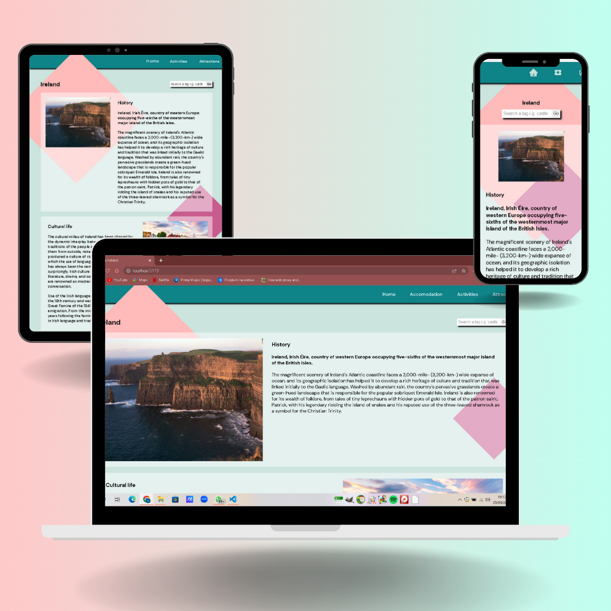

# Explorer-project
Progettino realizzato con Vite, sito vetrina interattivo con più pagine 🤩

# Scheda tecnica 📊
 
 🖧  API: https://failteireland.azure-api.net/opendata-api/v1  
 
 👩‍💻 Linguaggio di programmazione: JSX  
 
 🖼️ Framework: React  
 
 🎨 Style: SASS & CSS Modules 
 
 
